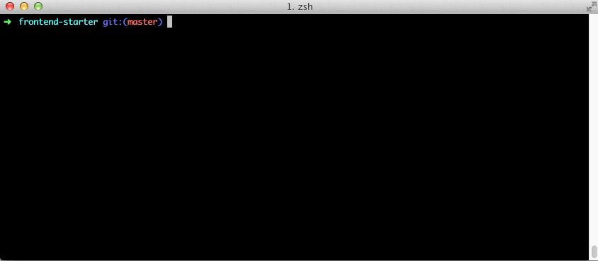

# Frontend starter

Very minimal frontend starter kit.



**Features:**

* Browserify
* Less
* Npm scripts based automation
* Tmux to nicely run concurrent tasks

## Install

```bash
npm install
brew install tmux
```
[tmux](http://tmux.sourceforge.net/) is for your convenience.

## Local development

Start local server, less watcher and watchify in a nice tabbed tmux terminal:

```bash
npm start
```

To close tmux, you can either kill each process individually or just `Alt-C`.

### How to install jQuery etc.?

Just `npm install --save jquery` and use `var $ = require('jquery')`. Browserify
takes care of building JS.
